# Hi, I'm sanks 👋

**Full-Stack Engineer · Web Engineering · AI-Assisted Development**

热衷于 Web 技术、工程实践与持续学习。

关注从前端体验到后端服务的完整开发链路，
并持续探索 AI 在软件工程中的实际应用。

> Knowledge translated into action is the effect of ability.

## 🧭 Focus

- ⚡ Web Engineering
- 🖥️ Frontend Architecture
- 🔧 Full-Stack Development
- 🤖 AI-Assisted Development
- 📚 Technical Writing & Knowledge Sharing

## 🛠 Tech Stack

**Frontend**

`JavaScript` `TypeScript` `Vue` `React`

**Backend**

`Node.js` `Koa` `NestJS` `Java`

**Engineering**

`Git` `Docker` `WebSocket` `REST API`

**Currently Exploring**

`AI Coding` `AI Agent` `LLM Applications`

## 🚀 Projects

### 🌐 Personal Blog

我的个人技术博客与知识记录。

👉 [sanks-blog.com](https://www.sanks-blog.com)

### 🔌 react-socket-server

基于 Koa.js 的 WebSocket 服务实践。

### ⚛️ react-koa-typescript

React + Koa + TypeScript 的 SSR 工程实践。

## ✍️ About Me

我更关注技术如何真正解决问题，而不只是框架本身。

从前端组件、工程化、实时通信到全栈系统，
持续学习、实践并记录值得沉淀的技术经验。

## 📊 GitHub

  
  

